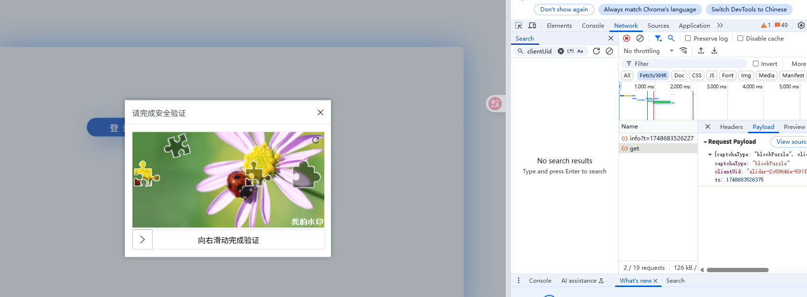

## 简介

Captcha行为验证码，包含滑动拼图、文字点选两种方式，UI支持弹出和嵌入两种方式。

后端提供Java实现，前端提供了vue、vue3、uni-app等代码示例。

### 概念术语描述

| 术语    | 描述                                                                  |
|-------|---------------------------------------------------------------------|
| 验证码类型 | 1）滑动拼图 blockPuzzle  2）文字点选 clickWord                                |
| 验证    | 用户拖动/点击一次验证码拼图即视为一次“验证”，不论拼图/点击是否正确                                 |
| 二次校验  | 验证数据随表单提交到后台后，后台需要调用captchaService.verification做二次校验。目的是核实验证数据的有效性。 |

# 3 交互流程

① 用户访问应用页面，请求显示行为验证码<br>
② 用户按照提示要求完成验证码拼图/点击<br>
③ 用户提交表单，前端将第二步的输出一同提交到后台<br>
④ 验证数据随表单提交到后台后，后台需要调用captchaService.verification做二次校验。<br>
⑤ 第4步返回校验通过/失败到产品应用后端，再返回到前端。如下图所示。

#### 本地启动

第一步，启动后端，导入Eclipse或者Intellij,启动service/springboot的StartApplication。

第二步，启动前端，使用visual code打开文件夹view/vue，npm install后npm run dev，浏览器登录<br>



```java
{
    "repCode": "0000",
    "repMsg": null,
    "repData": {
        // 验证码ID
        "captchaId": null,
        // 项目代码
        "projectCode": null,
        // 验证码类型
        "captchaType": null,
        // 验证码原图路径
        "captchaOriginalPath": null,
        // 验证码字体类型
        "captchaFontType": null,
        // 验证码字体大小
        "captchaFontSize": null,
        // 密钥
        "secretKey": "loaU5rfAQD0rWTag",
        // 原始图片Base64编码
        "originalImageBase64": "iVfYNu+OHvm6/37PKiXhgexuDwWAwGAwGg8FgMBgMBoPBYDAYDAaDwWAwGAwGg8FgMBgMBoPBYDAYDMYty78AsHlJMbliz9QAAAAASUVORK5CYII=",
        // 字母列表
        "wordList": null,
        // 点列表
        "pointList": null,
        // 点JSON
        "pointJson": null,
        // 令牌
        "token": "1611590c12474d00ac2bf81a63512d19",
        "result": false,
        // 验证码验证
        "captchaVerification": null,
        // 客户端UID
        "clientUid": null,
        // 时间戳
        "ts": null,
        // 浏览器信息
        "browserInfo": null
    },
    "success": true
}
```

```java
{
    "captchaType":"blockPuzzle", // 验证码类型为滑块拼图
        "clientUid":"slider-2c59646e-597f-4775-99df-5a2c97dcdb3b", // 客户端唯一标识
        "ts":1748683526375 // 时间戳
}
```

check

```java
{
    "captchaType":"blockPuzzle", // 验证码类型为滑块拼图
        "pointJson":"82k8ETAxYspsVTWAPPRubnR7Fq+jSwQYu3VexgTaE0w=", // 验证码坐标信息
        "token":"27d33302f2a14edb9185921d9d730525" // 验证码token
}
```

```java
{
    "repCode": "0000",
    "repMsg": null,
    "repData": {
        // 验证码ID
        "captchaId": null,
        // 项目代码
        "projectCode": null,
        // 验证码类型
        "captchaType": null,
        // 验证码原始路径
        "captchaOriginalPath": null,
        // 验证码字体类型
        "captchaFontType": null,
        // 验证码字体大小
        "captchaFontSize": null,
        // 密钥
        "secretKey": "Y6kvfzIo0fRaE5E0",
        // 原始图片Base64编码
        "originalImageBase64": "iVBORw0KGgoAAAANSUhEUgAAATYAAACbCAIAAABnKyB6AACAAElEQVR42kS8d3Mj6ZXu2R9o/AfwAJNL2YpFHlWgAAAABJRU5ErkJggg==",
        // 单词列表
        "wordList": null,
        // 点列表
        "pointList": null,
        // 点JSON
        "pointJson": null,
        "token": "373193ae2724486983ffc72430c42050",
        "result": false,
        // 验证码验证
        "captchaVerification": null,
        // 客户端UID
        "clientUid": null,
        // 时间戳
        "ts": null,
        // 浏览器信息
        "browserInfo": null
    },
    "success": true
}
```


